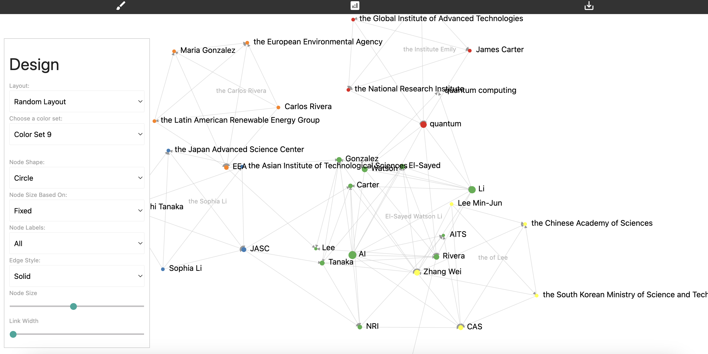

# StorylineMapper

`StorylineMapper` is a Python tool for performing community detection on narrative texts. It uses advanced network analysis techniques to identify and visualize relationships and communities within the text, helping to uncover hidden connections and structures.




## Table of Contents

- [Prerequisites](#prerequisites)
- [Installation](#installation)
- [Usage](#usage)
- [Options](#options)
- [Output](#output)
- [Example](#example)
- [License](#license)

## Prerequisites

Before you start, ensure you have the following prerequisites installed on your machine:

- **Python 3.12+**: Make sure Python is installed and added to your system's PATH.
- **pip**: Python's package installer should also be installed.

## Installation

1. **Clone the repository**:
   ```bash
   git clone https://github.com/yourusername/storylinemapper.git
   cd storylinemapper

2. **Install required dependencies:**:
    ```bash
    pip install -r requirements.txt
    pip install -e .
    python -m spacy download en_core_web_sm


3. **Usage:**

To run StorylineMapper, use the following command in your terminal:


    storylinemapper community-detection "YOUR_TEXT_HERE" --method louvain --output OUTPUT_FILENAME --design-options


Example

Here is an example command to run community detection using the Louvain method and output the results to community_network.html

    ```bash
    storylinemapper community-detection "Dr. Emily Watson, a leading scientist from the Global Institute of Advanced Technologies (GIAT), collaborated with Dr. James Carter from the National Research Institute (NRI) on a groundbreaking quantum computing project..." --method louvain --output community_network.html --design-options


## Options

- `--method`: Specifies the community detection method to use (e.g., louvain, infomap, etc.). Default is louvain.
- `--output`: Specifies the output file name (e.g., community_network.html).
- `--design-options`: Adds additional design options to the visualization, such as node shapes, colors, and layouts.

## Output

The output file will be an HTML file (`community_network.html` in the example) containing a visual representation of the detected communities and relationships between entities in the text.
